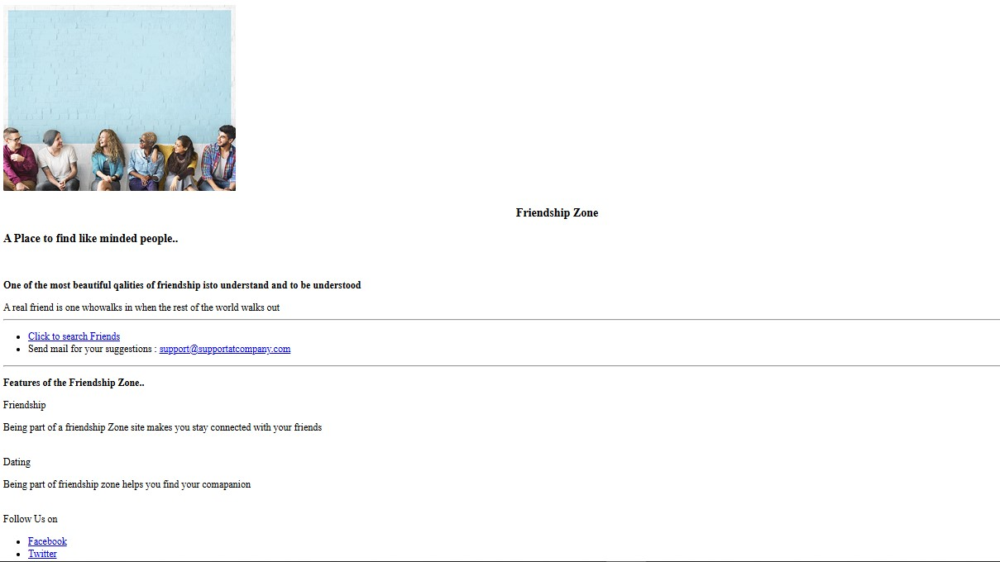

# 💖 Friendship Zone

**Friendship Zone** is a beginner-friendly HTML project created as part of the **Infosys Springboard HTML course**. The project consists of 5 interconnected pages showcasing user interface design, form handling, and table-based data presentation—built entirely using **HTML5** and **CSS**.

---

## 📄 Project Description

The **Friendship Zone** website allows users to explore a simple UI for:

- Browsing a homepage
- Viewing a list of friends
- Registering as a user or admin
- Receiving a registration confirmation

This project demonstrates practical knowledge gained during the course, such as building structured web pages, using HTML forms, implementing semantic elements, and styling with CSS.

---

## 🧩 Pages Overview

| Page | Description |
|------|-------------|
| `index.html` | **Homepage** introducing the platform |
| `friendlist.html` | Displays a table of friends with basic information |
| `registrationform.html` | Registration form for users and admins |
| `registerationconfirmation.html` | Confirmation page for normal user registration |
| `registerationconfirmationforAdmin.html` | Confirmation page for admin registration |

---

## 🎯 Features

- Clean and responsive layout using only HTML and CSS
- Table-based friend list with rows and columns
- Registration form with:
  - Input fields (Name, Email, Age, etc.)
  - Radio buttons (Gender)
  - Checkboxes (Interest: Friendship / Dating)
  - File upload option
- Two types of registration:
  - **User registration** (leads to user confirmation page)
  - **Admin registration** (leads to admin confirmation page)
- JavaScript for dynamic form submission based on role

---

## 🖼 Screenshots

> Homepage  
> 

> Friend List  
> 

> Registration Form  
> 

> Confirmation Page for User  
> 

> Confirmation Page for Admin  
> 

> *(Make sure to add actual screenshots in the `screenshots/` folder and update the file names if needed.)*

---

## 🚀 How to Run the Project

1. **Clone the Repository**
   ```bash
   git clone https://github.com/yourusername/friendship-zone.git

   just run it on your browser :)
